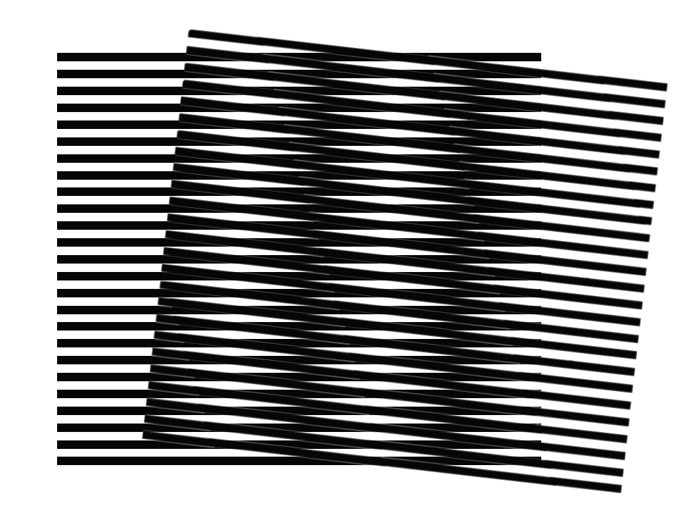

  

# SIM Denoising Project

NOTE: This is the main branch. The final versions of the report and executive summary are here.

For snapshot releases, switch to the release branch (latest release 1.1.)

## Description

This repository contains software that implements Li et al.'s "two-step denoising" method for improving the signal-to-noise ratio of structured illumination microscopy image reconstructions.

The goal of this project is to:
1. provide a modular, documented, open-source version of the full data processing pipeline required to implement this method, and
2. apply the method to different datasets in order to investigate the reproducibility of the claims of the original research [[1]](#key_paper).

As such, the repository contains:
- `src/`; source code that implements the method, including extra tools to build synthetic datasets and analyse the models,
- `test/`; code implementing the unit testing suite (can be fully run with command `pytest` in repository root),
- `docs/`; documentation in html and pdf form,
- `model/`; model checkpoints and config files used to train these models,
- `figures/`; contains some analysis plots,
- `report/`; contains the main report on the project (7000 words),
- `summary/`; contains the executive summary on the project (1000 words).

## How to use

Firstly, reproduce the python environment using

`python -m venv SD_ENV`

`source SD_ENV/bin/activate` (for Linux and macOS)

`pip install --upgrade pip` (optional but recommended)

`pip install -r requirements.txt`

Then the training code can be run via

`python train.py -c config.json -o model`

All scripts within `src/` can be run in this environment,
except for `generate_sim.py` which requires the slightly different pip environment reproduced in the same way from `requirements_synth.txt`.

Note also that a key part of the pipeline involves using the fairSIM [[4]](#fairsim) plugin for imageJ, version 1.4.1,
which can be downloaded [here](https://github.com/fairSIM/fairSIM/releases/tag/v1.4.1)

The model training was performed using Nvidia A100 graphical processing units accessed using Cambridge's CSD3 service via Wilkes3 nodes.

The rest of the pipeline was processed mostly using a personal computer with an Intel(R) Core&trade; i5 processor.

## Model index

- Models m019 and m020 constitute the 1st and 2nd steps of the pipeline that was trained on the microtubules images only.
- Models m023 and m024 are the 1st and 2nd steps for the 2D SIM pipeline (full dataset)
- Models m021 and m022 are the 1st and 2nd steps for the 3D SIM pipeline.

## Acknowledgements

The source code has been adapted from earlier work that implemented the RCAN deep neural network architecture for a range of applications within fluorescence microscopy [[2]](#rcan). The original version of that code can be found [here](https://github.com/AiviaCommunity/3D-RCAN) and was released with the following copyright and licensing:

> Copyright © 2021 [SVision Technologies LLC.](https://www.aivia-software.com/)
> Copyright © 2021-2022 Leica Microsystems, Inc.
>
> Released under Creative Commons Attribution-NonCommercial 4.0 International Public License ([CC BY-NC 4.0](https://creativecommons.org/licenses/by-nc/4.0/))

This original code has been migrated to PyTorch, with parts of the PyTorch training pipeline adapted from another repository which can be found [here](https://github.com/edward-n-ward/ML-OS-SIM/tree/master); this software is also associated to recent research investigating the use of machine learning to improve the SIM reconstruction process [[3]](#ml_os_sim).

The use of the Visible Human Dataset in the project is courtesy of the U.S. National Library of Medicine.

This work was performed using resources provided by the Cambridge Service for Data Driven Discovery (CSD3) operated by the University of Cambridge Research Computing Service (www.csd3.cam.ac.uk),
provided by Dell EMC and Intel using Tier-2 funding from the Engineering and Physical Sciences Research Council (capital grant EP/T022159/1),
and DiRAC funding from the Science and Technology Facilities Council (www.dirac.ac.uk).

## References

<a id="key_paper">[1]</a>
Li, X., Wu, Y., Su, Y. et al. Three-dimensional structured illumination microscopy with enhanced axial resolution. Nat Biotechnol 41, 1307–1319 (2023). [https://doi.org/10.1038/s41587-022-01651-1](https://doi.org/10.1038/s41587-022-01651-1)

<a id="rcan">[2]</a>
Chen, J., Sasaki, H., Lai, H. et al. Three-dimensional residual channel attention networks denoise and sharpen fluorescence microscopy image volumes. Nat Methods 18, 678–687 (2021). [https://doi.org/10.1038/s41592-021-01155-x](https://doi.org/10.1038/s41592-021-01155-x)

<a id="ml_os_sim">[3]</a> Edward N. Ward, Rebecca M. McClelland, Jacob R. Lamb, Roger Rubio-Sánchez, Charles N. Christensen, Bismoy Mazumder, Sofia Kapsiani, Luca Mascheroni, Lorenzo Di Michele, Gabriele S. Kaminski Schierle, and Clemens F. Kaminski, "Fast, multicolour optical sectioning over extended fields of view with patterned illumination and machine learning," Biomed. Opt. Express 15, 1074-1088 (2024) [https://doi.org/10.1364/BOE.510912](https://doi.org/10.1364/BOE.510912)

<a id="fairsim">[4]</a> M. Müller, V. Mönkemöller, S. Hennig, W. Hübner, T. Huser Open-source image reconstruction of super-resolution structured illumination microscopy data in ImageJ, Nature Communications, 7(1), 10980. [doi:10.1038/ncomms10980](doi:10.1038/ncomms10980)
